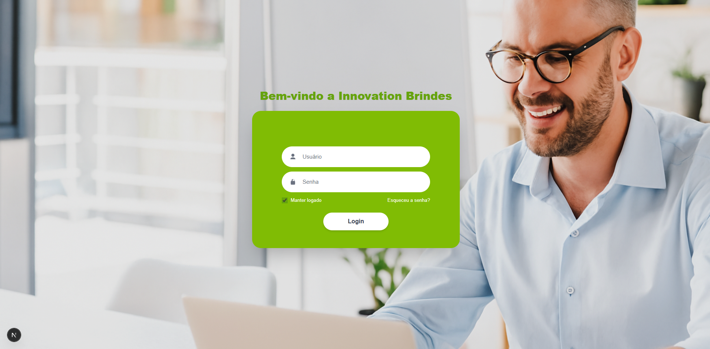
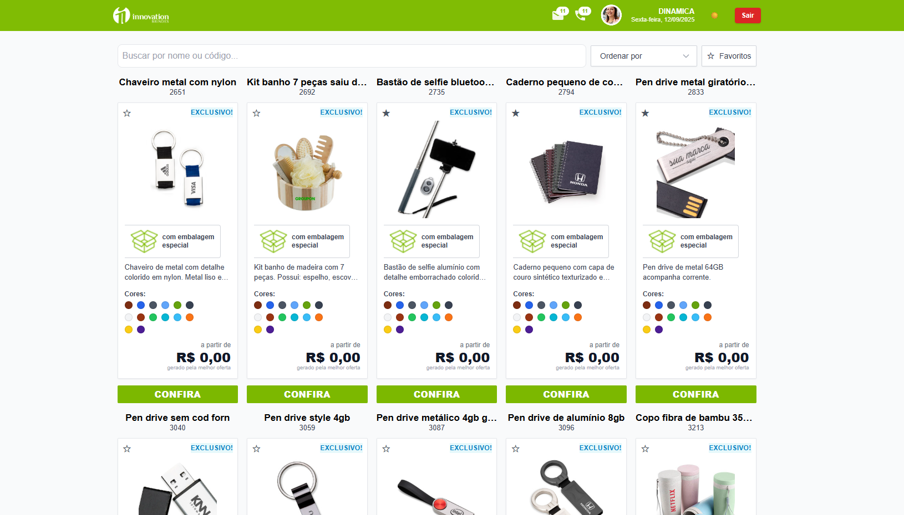

# Innovation Brindes — Mini App / Versão 0001

Aplicação desenvolvida em **Next.js + TypeScript + TailwindCSS** para teste técnico.  
Inclui fluxo de autenticação, gerenciamento de sessão com **Zustand**, favoritos persistidos e listagem de produtos.

## Requisitos

- **Node.js**: v18 ou superior 

## 🚀 Como rodar o projeto

Clone o repositório, instale as dependências com `npm install` e rode o servidor de desenvolvimento com `npm run dev`.  
O projeto ficará disponível em `http://localhost:3000`.

## 🔑 Variáveis de ambiente

Crie um arquivo `.env.local` na raiz do projeto com a variável:
NEXT_PUBLIC_API_BASE=https://sua-api.com

Essa variável define a URL base para as chamadas de API.

## 🧠 Decisões tomadas

### Next.js (Pages Router)
- Simplicidade e rapidez para o escopo do teste.
- `ProductModal` carregado sob demanda via `next/dynamic` (code-splitting).

### Gerenciamento de estado com Zustand
- `authUser`: armazena `dados_usuario` **normalizados** (trim de espaços) e **persistidos** em `localStorage`.
- `useFavorites`: favoritos persistidos com `persist`.
- **Motivo:** API leve, sem boilerplate, com hidratação automática.

### Autenticação / sessão
- Token salvo em `localStorage` (quando “manter logado”) ou `sessionStorage`.
- Token também espelhado em cookie (`auth_token`) para o **middleware**.
- Middleware protege `/produtos`; sem token → redirect para `/login`.

### HTTP com axios + interceptors
- Interceptor de **request**: anexa `Authorization: Bearer <token>`.
- Interceptor de **response**: em **401**, limpa token + usuário e redireciona para `/login`.

### Data fetching com SWR
- Hook `useProducts`: cache, revalidação e deduplicação.
- Busca por **nome** ou **código**; normalização (acentos/minúsculas); **debounce** no input.
- **Motivo:** cenário de leitura simples → **SWR** é mais leve que React Query.

### UI com Tailwind

- **Mobile-first**, utilitárias reutilizáveis.
- Dark mode por classe (`darkMode: "class"`), com toggle (`ThemeToggle`) e preferência salva em `localStorage`.
- Script inline no `_document` aplica a classe `dark` antes da renderização (evita _flash_).

### Acessibilidade (a11y)

- Labels reais (`<label htmlFor="...">`), `aria-label` / `aria-labelledby` quando necessário.
- Landmarks: `role="search"`, `role="main"`, `role="list"` / `role="listitem"`.
- Estados anunciáveis: `role="status"` / `role="alert"` com `aria-live`.
- Modal com Headless UI; botões com `aria-pressed`, `aria-haspopup`.
- Imagens com `alt` significativo.

### Performance / UX

- `IntersectionObserver` para **infinite scroll**.
- `useMemo` em ordenação/filtragem.
- `loading="lazy"` nas imagens + **placeholder** em erro.

### Testes

- **Vitest + React Testing Library** (JSDOM).
- Mocks de `next/image`, `next/link` e `next/router`.
- Testes de UI mínimos: `Navbar` (integra com store) e `ProductModal` (render/fechar).

# Checklist — Status

## Funcionais

- ✅ **/login** com e-mail, senha, “manter logado”, link “esqueceu a senha?”
- ✅ Chama **POST /login/acessar**, salva token e redireciona
- ✅ Bloqueio de **/produtos** sem token (redirect)
- ✅ Grid responsivo dos cards (imagem, nome, código, preço, botão **CONFIRA**, selo **EXCLUSIVO!**)
- ✅ Busca com **debounce (400ms)** e nome **OU** código (POST de listagem com filtros)
- ✅ Estado vazio quando não há resultados
- ✅ **Paginação infinite scroll** estável
- ✅ Ordenação local por **preço** e **nome**
- ✅ **Modal de detalhes** (code-splitting já com `dynamic`)
- ✅ Favoritar + persistir em **localStorage** + filtro “apenas favoritos”
- ✅ Skeleton na 1ª carga
- ✅ Erro com **“Tentar novamente”**
- ✅ **401** força logout + redirect
- ✅ Preço formatado em **BRL**

---

## Técnicos

- ✅ **Next.js (pages)** + **TypeScript** + **Tailwind** + **Zustand**
- ✅ **SWR** para cache/revalidação (hook `useProducts`)
- ✅ **Interceptor global (axios)**: anexa `Authorization: Bearer <token>` e, em **401**, limpa sessão e redireciona
- ✅ **Responsividade mobile-first**
- ✅ **Acessibilidade**: labels/`aria-*` no login e produtos, landmarks (`role="main"`, `role="search"`, `role="list"`), `role="alert"/"status"`; modal Headless UI com foco gerenciado
- ✅ **SEO**: `<title>` e `<meta name="description">` em `/login` e `/produtos`
- ✅ Tratamento de estados refinado (ex.: placeholder de imagem, retry/backoff).
- ⏳ **Lighthouse ≥ 90 (Desktop)**: **rodar e anexar** screenshot no README (`images/lighthouse.webp`)
- ⏳1 smoke E2E (Playwright) que valide fluxo: login → ver grid

---

## Diferenciais (opcionais)
- ✅ **Rota protegida** (middleware + guard)
- ✅ **Dark mode** (toggle com preferência salva e sem _flash_)
- ✅ **Code-splitting** do modal (`next/dynamic`)
- ✅ **Testes unitários** (Vitest + React Testing Library): `Navbar` e `ProductModal`
- ✅ **Tratamento de estados**: skeleton, erro com “Tentar novamente”, **placeholder** de imagem
- ✅ **Retry/backoff global (SWRConfig)**: `errorRetryCount=2`, `errorRetryInterval=1500ms`, `revalidateOnFocus=false`, `dedupingInterval=10000`  
  _(ver `src/pages/_app.tsx`)_
- ⏳ **Design-system simples** (Button/Card/Input)

---

## Entrega
- ✅ Repositório público
- ⚠️ **README**: screenshot Lighthouse e GIF do fluxo

## 🌐 Deploy

O projeto foi implantado na **Vercel** e pode ser acessado nos links (necessário autenticação):

- [Página inicial](https://mini-app-innovation-brindes.vercel.app/)
- [Login](https://mini-app-innovation-brindes.vercel.app/login)
- [Produtos](https://mini-app-innovation-brindes.vercel.app/produtos)

# App - Tela de Login Desktop

# App - Tela de produtos Desktop

