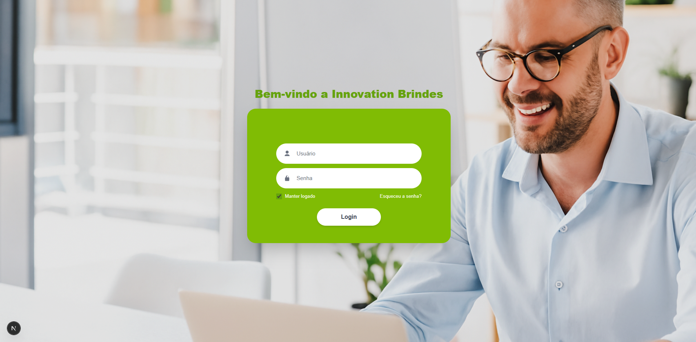
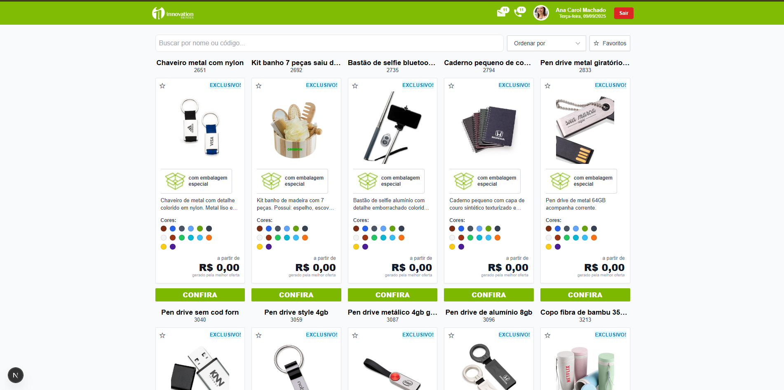

# Innovation Brindes — Mini App / Versão 0001

Aplicação desenvolvida em **Next.js + TypeScript + TailwindCSS** para teste técnico.  
Inclui fluxo de autenticação, gerenciamento de sessão com **Zustand**, favoritos persistidos e listagem de produtos.

## Requisitos

- **Node.js**: v18 ou superior 

## 🚀 Como rodar o projeto

Clone o repositório, instale as dependências com `npm install` e rode o servidor de desenvolvimento com `npm run dev`.  
O projeto ficará disponível em `http://localhost:3000`.

## 🔑 Variáveis de ambiente

Crie um arquivo `.env.local` na raiz do projeto com a variável:
NEXT_PUBLIC_API_BASE=https://sua-api.com

Essa variável define a URL base para as chamadas de API.

## 🛠️ Decisões técnicas

- **Framework**: [Next.js](https://nextjs.org/) escolhido pela simplicidade e suporte a SSR/SSG.  
- **Estilização**: [TailwindCSS](https://tailwindcss.com/) para agilizar a construção da interface.  
- **Gerenciamento de estado global**: [Zustand](https://github.com/pmndrs/zustand) para controlar autenticação e favoritos com persistência em storage.  
- **Autenticação**: controle de sessão via token JWT, armazenado em `localStorage` quando a opção *remember me* está ativa.  

# Checklist — Status

## Funcionais
- ✅ **/login** com e-mail, senha, “manter logado”, link “esqueceu a senha?”
- ✅ Chama **POST /login/acessar**, salva token e redireciona
- ✅ Bloqueio de **/produtos** sem token (redirect)
- ✅ Grid responsivo dos cards (imagem, nome, código, preço, botão **CONFIRA**, selo **EXCLUSIVO!**)
- ✅ Busca com **debounce (400ms)** e nome **OU** código (POST de listagem com filtros)
- ✅ Estado vazio quando não há resultados
- ✅ **Paginação infinite scroll** estável
- ✅ Ordenação local por **preço** e **nome**
- ✅ **Modal de detalhes** (code-splitting já com `dynamic`)
- ✅ Favoritar + persistir em **localStorage** + filtro “apenas favoritos”
- ✅ Skeleton na 1ª carga
- ✅ Erro com **“Tentar novamente”**
- ✅ **401** força logout + redirect
- ✅ Preço formatado em **BRL**

---

## Técnicos
- ✅ **Next.js (pages)** + **TypeScript** + **Tailwind** + **Zustand**
- ⚠️ **SWR ou React Query**: ainda não (estamos em fetch/estado manual)
- ⚠️ **Interceptor global** adicionando `Authorization: Bearer <token>`: hoje o `401` é tratado no componente; vale mover para interceptor
- ✅ **Responsividade mobile-first**
- ⚠️ **Acessibilidade**: está boa, mas revisar `labels/aria` do login e **focus trap** no modal para cravar 100
- ✅ **SEO**: `<title>` e `<meta description>` em `/produtos` (conferir também em `/login`)
- ⚠️ **Lighthouse ≥ 90**: precisa rodar e anexar screenshot

---

## Diferenciais (opcionais)
- ✅ **Rota protegida** (redirect automático na ausência de token)
- ⚠️ **Dark mode** (toggle)
- ✅ **Code-splitting** do modal (já temos)
- ⚠️ **Testes** (unitário + smoke E2E)
- ⚠️ Placeholders/retry/backoff extras
- ⚠️ Pequeno **design-system** (Button/Card/Input)

---

## Entrega
- ✅ Repositório público
- ⚠️ **README**: screenshot Lighthouse e GIF do fluxo

## 🌐 Deploy

O projeto foi implantado na **Vercel** e pode ser acessado nos links (necessário autenticação):

- [Página inicial](https://mini-app-innovation-brindes.vercel.app/)  
- [Login](https://mini-app-innovation-brindes.vercel.app/login)  
- [Produtos](https://mini-app-innovation-brindes.vercel.app/produtos)

# App - Tela de Login Desktop

# App - Tela de produtos Desktop
